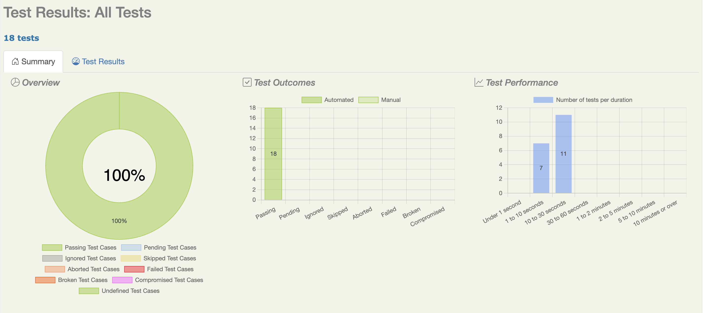

# Bug Report — Optimizador de Envíos
## Hallazgos encontrados durante la ejecución de pruebas E2E con Serenity BDD

**Proyecto:** Optimizador de Envíos  
**Developer:** [Santiago Angarita Avila](https://github.com/sanavi01)
**QA Engineer:** [Nahuel Lemes](https://github.com/nahulemesf)  
**Ambiente:** QA (`http://localhost` vía Nginx proxy · frontend en `http://localhost/app`)  
**Framework:** Serenity BDD 4.x · Cucumber JUnit Platform · Selenium WebDriver (Chrome)  
**Estado final del suite:** ✅ BUILD SUCCESS — 18 escenarios pasados, 0 fallidos (1 ignorado con `@ignore`)

---

## Reporte HTML



---

## Resumen

Durante la implementación y ejecución del suite de pruebas E2E con Serenity BDD, las pruebas cubrieron **8 historias de usuario** con un total de **19 casos de prueba**: 18 ejecutados exitosamente y 1 marcado como `@ignore`. Se encontró **1 limitación de entorno** que impide ejecutar un caso de prueba definido en los Test Cases. Esta limitación no representa un defecto del sistema bajo prueba, sino una restricción derivada de la estrategia de datos mockeados.


| ID | Categoría | Severidad | Estado |
|---|---|---|---|
| BUG-E2E-001 | Limitación de entorno / datos mockeados | 🟡 Medio | ⚠️ Ignorado — requiere stub de alternativas vacías |

---

## Cobertura de pruebas

| Historia | Caso de prueba | Tipo | Prioridad | Resultado |
|---|---|---|---|---|
| HU-07 Registrar usuario | TC-HU07-01 | Escenario | 🔴 Crítico | ✅ Pasó |
| HU-08 Iniciar sesión | TC-HU08-01 | Escenario | 🔴 Crítico | ✅ Pasó |
| HU-08 Iniciar sesión | TC-HU08-04 | Escenario | 🔴 Crítico | ✅ Pasó |
| HU-08 Iniciar sesión | TC-HU08-06 | Escenario | 🟡 Medio | ✅ Pasó |
| HU-01 Registrar pedido | TC-HU01-01 | Escenario | 🔴 Crítico | ✅ Pasó |
| HU-01 Registrar pedido | TC-HU01-02 | Escenario | 🟠 Alto | ✅ Pasó |
| HU-02 Prioridad de envío | TC-HU02-01 (COST) | Esquema | 🔴 Crítico | ✅ Pasó |
| HU-02 Prioridad de envío | TC-HU02-01 (TIME) | Esquema | 🔴 Crítico | ✅ Pasó |
| HU-04 Alternativas proveedores | TC-HU04-01 | Escenario | 🔴 Crítico | ✅ Pasó |
| HU-04 Alternativas proveedores | TC-HU04-02 | Escenario | 🟠 Alto | ⚠️ Ignorado |
| HU-05 Seleccionar y confirmar | TC-HU05-01 (COST) | Esquema | 🔴 Crítico | ✅ Pasó |
| HU-05 Seleccionar y confirmar | TC-HU05-01 (TIME) | Esquema | 🔴 Crítico | ✅ Pasó |
| HU-06 Ruta en el mapa | TC-HU06-01 (COST) | Esquema | 🔴 Crítico | ✅ Pasó |
| HU-06 Ruta en el mapa | TC-HU06-01 (TIME) | Esquema | 🔴 Crítico | ✅ Pasó |
| HU-06 Ruta en el mapa | TC-HU06-02 (COST) | Esquema | 🟠 Alto | ✅ Pasó |
| HU-06 Ruta en el mapa | TC-HU06-02 (TIME) | Esquema | 🟠 Alto | ✅ Pasó |
| HU-06 Ruta en el mapa | TC-HU06-04 | Escenario | 🟠 Alto | ✅ Pasó |
| HU-09 Consultar pedidos | TC-HU09-01 | Escenario | 🔴 Crítico | ✅ Pasó |
| HU-09 Consultar pedidos | TC-HU09-02 | Escenario | 🟠 Alto | ✅ Pasó |

**Total:** 19 casos de prueba · 18 ejecutados ✅ · 1 ignorado ⚠️ · 0 fallidos ❌

---

## Detalle de hallazgos

---

### BUG-E2E-001 — TC-HU04-02 no ejecutable con datos mockeados de proveedores

| Campo | Detalle |
|---|---|
| **ID** | BUG-E2E-001 |
| **Severidad** | 🟡 Medio |
| **Historia** | HU-04 Obtener opciones alternativas de proveedores |
| **Caso de prueba** | TC-HU04-02 — Ausencia de opciones alternativas |
| **Estado** | ⚠️ Ignorado (`@ignore`) — requiere stub de alternativas vacías |

**Descripción:**  
El caso de prueba TC-HU04-02 verifica que, cuando no existen proveedores alternativos, la UI muestre el mensaje correspondiente. Sin embargo, el entorno de QA responde siempre con un conjunto fijo de alternativas mockeadas, por lo que la condición `Y no existen alternativas` nunca puede cumplirse en este contexto.

Al intentar ejecutarlo, el step definition lanzaba `PendingException` ya que la pantalla de resultados siempre rinde alternativas:

```
HU04Runner > Cucumber > HU-04 > TC-HU04-02 - Ausencia de opciones alternativas FAILED
    io.cucumber.java.PendingException at HU04StepDefs.java:69
19 tests completed, 1 failed
```

**Solución aplicada:**  
El escenario fue marcado con `@ignore` en el `.feature` y el runner `HU04Runner` fue configurado con el filtro `FILTER_TAGS_PROPERTY_NAME = "not @ignore"` para excluirlo de la ejecución sin eliminarlo de la documentación.

**Recomendación:**  
Para habilitar este caso de prueba en el futuro, se puede:
1. Configurar un perfil de stub que retorne alternativas vacías (`alternatives: []`) en el endpoint de recomendación.
2. O bien, implementar un mecanismo de inyección de datos en el frontend que permita simular el estado vacío sin depender del API.

---

## Observaciones generales

- Los **Esquemas de escenario** en HU-02, HU-05 y HU-06 cubrieron correctamente las dos prioridades del sistema (`COST` y `TIME`), validando que el comportamiento de la UI es consistente independientemente de la prioridad seleccionada.
- El flujo completo de extremo a extremo —registro de usuario → inicio de sesión → registro de pedido → selección de prioridad → recomendación → confirmación → visualización de ruta → historial— fue verificado satisfactoriamente en el orden natural de las historias de usuario.
- La propiedad `headless.mode` del archivo `serenity.conf` se mantiene en `false` para permitir la demostración visual del suite con el navegador abierto.

---
